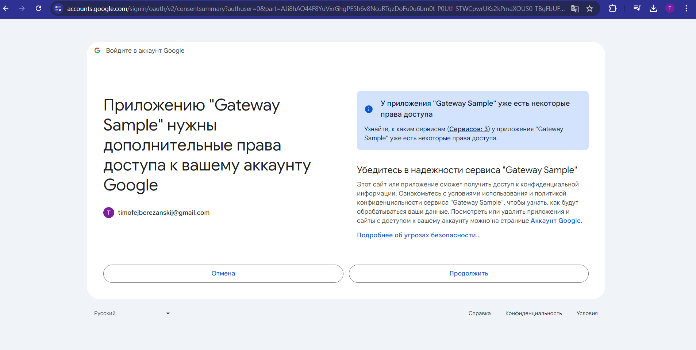

### Завдання до 5 модуля, 2 частина.

Під час виконання завдання виникли труднощі з бекендом. Сам бекенд піднявся на VM, відповідає.
Проте при спробі замінити шляхи для вірної роботи з задеплоїним бекендом отримую помилку:

Це не і не дивно бачити цю помилку, але днс назви я не знайшов для нього. 

Результат деплою бекенда:

Тобто сам бекенд по собі працює, але налаштування google credentials не вийшло. 

### Результат на localhost:

Авторизація:

Вивід пісень:

Вивід пісень по фільтру:

Видалення пісні по айді:

Вивід оновленої пісні:

